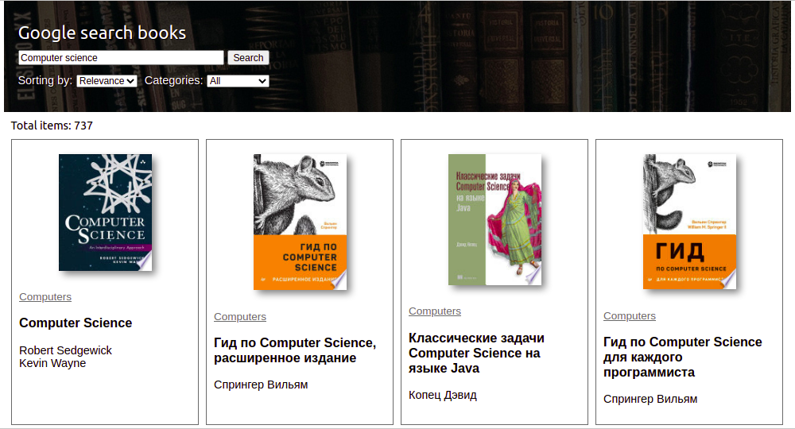
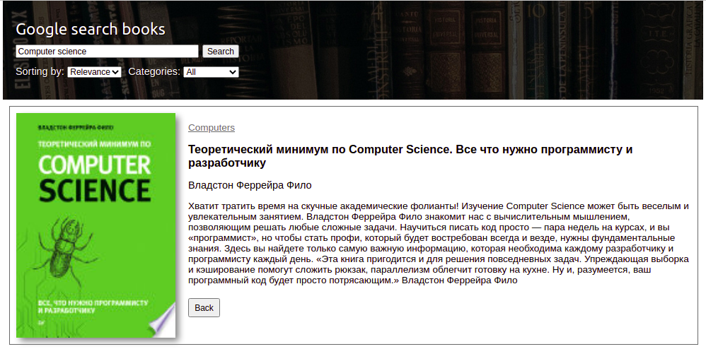

# React App for searching books 📚

Hello! My name is Dmitry Ingo Epikhin and this is my first project on React.

To run this app you should clone this repository on your machine and write `npm start` in the project directory. It will open in your browser (http://localhost:3000).

**Technology Stack:**
c React / Redux / React-redux / Redux-thunk
• JavaScript
• HTML / CSS
• Axios / Lodash

**Functional:**
• Books Search
• Displaying detailed information about the book
• Filter by category
• Sort by relevant and old books
• Load-more pagination

**API documentation:** https://developers.google.com/books/docs/v1/using

